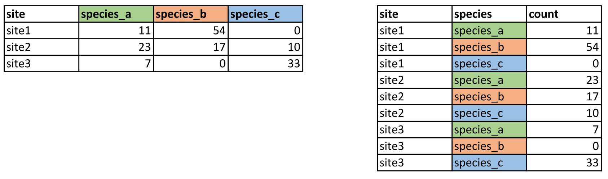

# Building on your foundations: going further with R {#ch02}

```{r html-doc, child="html_doc.Rmd", echo = FALSE}
```

```{r setup, include=FALSE}
source("setup.R")
library(tidyverse)
```

In the last chapter, we got to grips with the basics of R. Hopefully after completing the basic introduction, you feel more comfortable with the key concepts of R. Don't worry if you feel like you haven't understood everything - this is common and perfectly normal! Learning R is very much like learning a real language in that it takes time and practice to feel 'fluent'. Even if you do feel comfortable in the language, there is no shame in asking for help or looking for more information to develop your understanding. As regular R users, we still look things up constantly and there are one or two basics which we still forget, even with over a decade of experience of using the R environment! With this in mind, a goal of these R tutorials is to re-emphasise and reinforce basic concepts throughout. We will introduce concepts but through the practical demonstrations of code, we will underline them again and again.

In future chapters, we will be using a similar approach to reinforce the evolutionary genetic concepts you have encountered in the book. However, for this chapter we remain solely in the R environment and will instead switch our focus to more advanced features of R. Advanced does not necessarily mean more complicated - but it does mean that you need to have at least been introduced to the basic concepts. We will first 'level-up' our approach to handling and manipulating data. For this, we will be borrowing heavily from the [tidyverse](https://www.tidyverse.org) - a collection of packages and principles for data science in R. We will also introduce you to more advanced plotting, comparing the two most popular apporaches for plots - `base` and `ggplot`.

### What to expect {.unnumbered}

In this section we are going to:

-   explore more advanced methods of handling and manipulating data
-   learn how to plot data using `ggplot2`
-   learn how to reshape data with `pivot_longer()`

## Plotting your data with `ggplot2`

```{r html-doc, child="html_doc.Rmd", echo = FALSE}
```

In the last chapter, we learned that R is highly versatile when it comes to plotting and visualising data. Visualisation really cannot be understated - as datasets become larger and more difficult to handle, it is imperative you learn how to effectively plot and explore your data. This obviously takes practice, but plotting and summarising data visually is a key skill for guiding further analysis - this is especially true for evolutionary genomics but is easily applicable to any number of scientific fields.

As you may have gathered by now, there are lots of opinions on how to use R - whether you should use base or tidyverse approaches. We want to stress that there is nothing wrong with using base plotting, it is capable of some very impressive plots (use `demo(graphics)` to have a look). However `ggplot2` is extremely flexible and takes quite a different approach to plotting compared to baseR.

### The three things you need in a ggplot

You need three basic elements to construct a ggplot:[^exercise2-5]

[^exercise2-5]: There are more you *could* use, but these three are the ones that are strictly necessary.

1.  **Data:** this is your data set, and it *has to be contained in a data frame.*
2.  **Variables:** You need variables to plot on the x and y axes (mapping of variables)
3.  **Geometry:** You need some graphics in your plot: points, lines, boxplots, histograms etc.

Let's now use these three elements step-by-step to build up our plot. In our example, we want to make a scatterplot (plot with points) of height vs. mass in our `starwars` data set.

#### Data

First, we try supplying our data, `starwars`. The data is provided as an argument to the `ggplot()` function.

```{r}
ggplot(data = starwars)
```

As you can see, this results in a completely empty plot (because, like I said, we need two more things).

#### Variables

The variables are provided to the `mapping` argument of `ggplot()`. For reasons we won't discuss here, **all variables always have to be contained within the function `aes()`**. Let's try providing variables to our plot:

```{r}
ggplot(data = starwars, mapping = aes(x = height, y = mass))
```

Now we're getting somewhere! We have axes now, but we're still missing our points. Time to add the geometry.

#### Geometry

The geometry of a ggplot aren't provided to the `ggplot()` function as arguments. Instead, a separate function is added to the plot using `+`. All the functions for adding geometry start with `geom_`, and the one for points is called `geom_point()`. We add this to our plot:

```{r}
ggplot(data = starwars, mapping = aes(x = height, y = mass)) + geom_point()
```

Wohoo, we now have the plot we set out to make! There's an obvious outlier in the `mass` department, which we'll deal with later.

The philosophy behind adding geometry with a `+` is that you build up your plot, layer by layer. We could for example add a regression line in addition to points in our plot:

```{r}
ggplot(data = starwars, mapping = aes(x = height, y = mass)) + 
  geom_point() + #add points
  geom_smooth()  #add regression line
```

We could keep adding layers like this forever, as long as we felt we had some meaningful stuff to add.[^exercise2-6] Notice how we can have line breaks in our code after the `+`, the plot still executes.

[^exercise2-6]: Like this!

    ```{r}
    ggplot(data = starwars, mapping = aes(x = height, y = mass)) + 
      geom_point() + 
      geom_line() +
      geom_text(aes(label = name)) +
      geom_boxplot() +
      geom_violin() +
      geom_smooth()
    ```

    I know, I know, I did say "meaningful"

::: {.green}
**Important concept:**\
You need 3 things for a ggplot:

1.  **data** in a data frame (the `data` argument of `ggplot()`)
2.  **variables** -- which columns of your data do you want to plot? (the `mapping` argument of `ggplot()`, needs to be wrapped in `aes()`)
3.  **geometry** -- how do you want to represent your variables (separate functions, starting with `geom_`). You can add as many layers of geometry as you'd like.
:::

#### Interlude: filtering out the outlier

Before we continue, we should investigate our outlier, and remove it from our data to better see the pattern between mass and height.

**Exercise: Use the `dplyr` tools you learned earlier to find out who the outlier is, and make a subset of the data without that individual. Then, remake the plot with your subsetted data.**

<details>

<summary>

Show hint

</summary>

You know that the individual in question is really heavy. Use `filter()` on the `mass` column to find it!

</details>

::: {.fold .s .o}
```{r}
# find individuals with mass larger than 1000
starwars %>% filter(mass > 1000) %>%
  select(name, mass)

# If you’ve seen Star Wars, the answer to this shouldn’t be a huge surprise… 
# Let’s filter him out of the data

starwars2 <- starwars %>% filter(mass < 1000)

# and plot it

ggplot(data = starwars2, mapping = aes(x = height, y = mass)) + geom_point()
```
:::

### Storing ggplots in objects

A very useful feature of ggplots is that they can be stored in objects just like any other data. We will test this with the `starwars2` data frame we created above.

```{r}
sw_plot <- ggplot(data = starwars2, mapping = aes(x = height, y = mass))
sw_plot
```

We can now use this object as a base, and make different plots by adding `geom`s:

::: {.fold .o}
```{r}
# plot with points
sw_plot + geom_point()
# plot with line
sw_plot + geom_line()
# plot with regression line
sw_plot + geom_smooth()
```
:::

If you plan to make several plots with the same data and variables, you should save the basic plot to an object to avoid repeating yourself.

### Customizing your plots

#### General customization

So far, we've been using the `geom_` functions without arguments, but they actually take many of the same arguments as `plot()`. This means that you can use `col` to change color, `pch` to change point shape and `lty` to change line type:

```{r}
# create basic plot object
sw_plot <- ggplot(data = starwars2, mapping = aes(x = height, y = mass))

# add lines and points, and customize these
sw_pts_ln <- sw_plot + 
  geom_line(col = "steelblue", lty = 2) +
  geom_point(col = "firebrick", pch = 3)

# print plot
sw_pts_ln
```

Adding title and labels can be done by adding a separate function, `labs()`. `labs()` has, among others, the arguments `x`, `y`, `title` and `subtitle`, doing exactly what you would expect:[^exercise2-7]

[^exercise2-7]: Notice how our plot is built up layer by layer. Just to remind you, here's how the code for our plot would look without creating intermediary objects:

    ```{r, eval = FALSE}
    ggplot(data = starwars2, mapping = aes(x = height, y = mass)) +
      geom_line(col = "steelblue", lty = 2) +
      geom_point(col = "firebrick", pch = 3) +
      labs(x = "Height (cm)",
           y = "Mass (kg)",
           title = "Heigt vs. mass in the Star Wars universe",
           subtitle = "A part of the BIOS1140 ggplot tutorial")
      
    ```

    \ 


```{r}
sw_pts_ln +
  labs(x = "Height (cm)",
       y = "Mass (kg)",
       title = "Heigt vs. mass in the Star Wars universe",
       subtitle = "A part of the BIOS1140 ggplot tutorial")
```

#### Mapping variables to colors, shapes etc.

The modifications you've learned so far are nice for making plots pretty, but the real power of using colors and other aesthetics comes when they can contain additional information about your data. Here we introduce a powerful concept in `ggplot2` for doing this: **You can map data to more than just your axis labels**. In the following plot, the points are colored by their value in the `species` column, rather than all having the same color:

```{r, fig.asp = 0.5, fig.width=9}
ggplot(data = starwars2, mapping = aes(x = height, y = mass, col = species)) +
  geom_point()
```

One important thing to note here is that your variable has to be within `aes()` in your plot. Note that **variable names do not need quotes**. It's easy to get confused about when to put something inside `aes()` and not, but the general rule is:

-   If you're mapping color (or shape, linetype) to a **variable** in your data set, the `col` argument must be inside `aes()`.
-   If you're giving everything the same color (or shape, linetype), the `col` argument must be outside of `aes()`.

In this sense, mapping variables to e.g. color is no different than mapping to your x and y axes (which you would always wrap inside `aes()`)

As indicated above, other things than color can be mapped to aesthetics:

```{r}
ggplot(data = starwars2, mapping = aes(x = height, y = mass, pch = sex, lty = sex)) +
  geom_point() +
  # method=lm creates LINEAR regression, se=FALSE removes the grey confidence intervals
  geom_smooth(method = "lm", se = FALSE)
```

If you e.g. want to group your points by `sex`, but you don't want that same grouping for your lines, you can use the `mapping` argument of your `geom` instead:

```{r}
ggplot(data = starwars2, mapping = aes(x = height, y = mass)) +
  geom_point(mapping = aes(col = sex)) +
  geom_smooth(method = "lm", se = FALSE)
```

::: {.green}
**Important concept:**\
Variables can be mapped to aesthetics like color and point shape the same way they can be mapped to axes. Whenever you do this, you have to have your mapping within the `aes()` function. You can use the `mapping` argument of `ggplot()` to make your mapping global (i.e. for the entire plot), or the `mapping` argument of a geom to make the mapping exclusive to that geom.
:::

**Exercise: Make a scatter plot (plot with points) of height vs. birth year in the Star Wars data. Color the points by species. Add a single (linear) regression line that is *not* colored by species.**

<details>

<summary>

Show hint

</summary>

Map color within the `geom_point()` function in order to avoid having your regression line colored by species

</details>

::: {.fold .s .o}
```{r}
ggplot(data = starwars, mapping = aes(x = birth_year, y = height)) +
  geom_point(mapping = aes(col = species)) +
  geom_smooth(method = "lm", se = FALSE)
```
:::

::: {.blue}
**Tip:**\
From now on, we will no longer explicitly write the names of the `data` and `mapping` arguments. Instead, we will go with argument order, as explained in the tutorial last week. `data` is the first argument of `ggplot()` and `mapping` is the second. Remember that you can always recognize the `mapping` argument since it always contains the `aes()` function. Similarly, `x` and `y` are always the first and second arguments respectively of `aes()`.

This means that `ggplot(data = starwars, mapping = aes(x = height, y = mass))` can just as well be written `ggplot(starwars, aes(height, mass))`
:::

### Saving your plots

You can save your ggplot to a file using the function `ggsave()`. At the very least, you need to provide a plot object and a file name (with extension).

```{r, eval = FALSE}
# create our plot
sw_plot <- ggplot(data = starwars, mapping = aes(x = height, y = mass)) + 
  geom_point()

# save it
ggsave("sw_plot.png", sw_plot)
```

## Reshaping data with pivot_longer() {#pivot-longer}

```{r html-doc, child="html_doc.Rmd", echo = FALSE}
```

### Wide and long format

Let's say you have some biological data (finally, wohoo!), and want to plot it using `ggplot2`. There are (at least) two ways your data can be formatted:

```{r, echo = FALSE, fig.cap = 'Data in "wide format" (left) and "long format" (right)'}

```

These two formats are commonly referred to as "wide" and "long" respectively. If you want to make some plot that is e.g. colored by species in this data, **the data needs to be in long format**, i.e. the variable you are grouping by has to be contained in a single column. Data can be converted from wide to long using the tidyverse function `pivot_longer()`.

### Import example data

Let's import a data set to use as our example. Download `copepods.txt` [here](https://bios1140.github.io/data/copepods.txt). The data contains counts of different copepod taxa from outside Drøbak.

**Exercise: download the data and import it into R. Is this data "wide" or "long"?**

<details>

<summary>

Show hint

</summary>

Use the `read.table()` function. The data is tabulator separated with a header. Remember to work in the correct working directory!

</details>

::: {.fold .s}
```{r, eval = FALSE}
copepods <- read.table("copepods.txt", header = TRUE, sep = "\t")
```
:::

```{r, echo = FALSE}
copepods <- read.table("docs/data/copepods.txt", header = TRUE, sep = "\t")
```

Take a look at the data and how it's structured:

```{r}
copepods
```

### Reshape the data

As you hopefully figured out, this data is in so-called wide format, and we need to make it long with `pivot_longer()`. `pivot_longer()` has two important arguments called `names_to` and `values_to`. In our case `names_to` is the name of the new column of species, and `values_to` is the name of the new column where our values go. In addition, you need to provide the columns that you want to reshape. We can reshape this data like this:

```{r}
copepods_long <- copepods %>%
  pivot_longer(c(acartia, calanus, harpacticoida, oithona, oncaea, temora),
               names_to = "species", values_to = "count")

copepods_long
```

Note that `pivot_longer()` has the same way of selecting columns as `select()`, meaning we can use the minus sign to choose all columns except depth. The following code does the same as the one above:

```{r, eval = FALSE}
copepods_long <- copepods %>%
  pivot_longer(-depth, names_to = "species", values_to = "count")
```

That sure is more convenient than explicitly selecting all the columns we want (in our case, anyway)!

### Plot the data

Now we can plot the data! By now, you should know enough ggplot to attempt this yourself.

**Exercise: Make a plot where you have depth on the x-axis and count on the y-axis, and color by species. Experiment with using some different geoms and find the most suitable for visualising your data. When you've settled on a geom, create a title and axis labels, and save your finished plot with `ggsave()`**

<details>

<summary>

Show some geom ideas

</summary>

Try these, and see how they look for your data!

-   `geom_point()`
-   `geom_jitter()` (what is the difference between this and `geom_point()`?)
-   `geom_col()` (tip: use `fill` aesthetic instead of `col`)
-   `geom_boxplot()` (does this make sense?)
-   `geom_line()`
-   `geom_area()` (use `fill` for this one too)

</details>

<details>

<summary>

Show code and plots

</summary>

```{r, cache = TRUE}
depthplot <- ggplot(copepods_long, aes(depth, count, col = species))

depthplot + geom_point()
depthplot + geom_jitter()
depthplot + geom_col(aes(fill = species))
depthplot + geom_boxplot()
depthplot + geom_line()
depthplot + geom_area(aes(fill = species))
```

I'm settling on `geom_area()` since it nicely shows both total abundance and the relationship between the taxa (plus, it looks cool). Some additional tricks I do: flip the coordinates with `coord_flip()` to get depth on the y-axis, and plotting `-depth` instead of `depth` to plot depth downwards. I do this because it is how depth data is usually shown in marine biology, and because I wanted to show you that there are lots of options on customising plots that you will encounter as you learn more about ggplot.

```{r}
copeplot <- ggplot(copepods_long, aes(-depth, count)) + 
  geom_area(aes(fill = species)) +
  labs(title = "Number of individuals by depth",
       subtitle = "Data from Drøbak",
       x = "Depth (m)",
       y = "Count") +
  coord_flip()

copeplot
```

</details>

## Study questions

The study questions for week 1-2 are found [here](#w01). Deliver them in Canvas before the deadline as a word or pdf document. See [the appendix](#rmarkdown) for some important points on how the assignments should be delivered. There, you will also find an introduction to R Markdown, a good way to combine code, output and text for a report.

## Going further

As normal, R has a huge range of freely available resources online that can help you learn more about data manipulation, the tidyverse, ggplot2 and scripting. Here we point you to a few below that you might be interested in.

-   [Datacamp has an free introduction to using tidyverse packages to manipulate data](https://www.datacamp.com/courses/introduction-to-the-tidyverse)
-   [Hadley Wickham & Garrett Grolemund have written the definitive, freely available online book on using R for data manipulation - this is the 'bible' of the tidyverse approach and includes a section on ggplot2](http://r4ds.had.co.nz/)
-   [There is also a Datacamp course on ggpot2](https://www.datacamp.com/courses/data-visualization-with-ggplot2-1?tap_a=5644-dce66f&tap_s=213362-c9f98c)
-   [Winston Chang's R Graphic's Cookbook is also an excellent resource for using ggplot2 for data visualisation](http://www.cookbook-r.com/)
-   [A detailed software carpentry guide to R scripting](https://swcarpentry.github.io/r-novice-inflammation/06-best-practices-R/)
